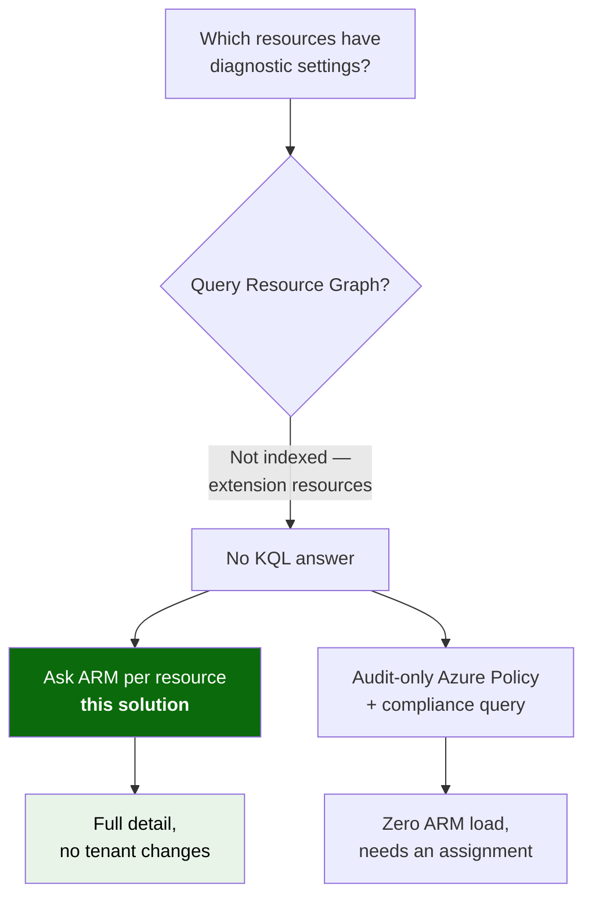
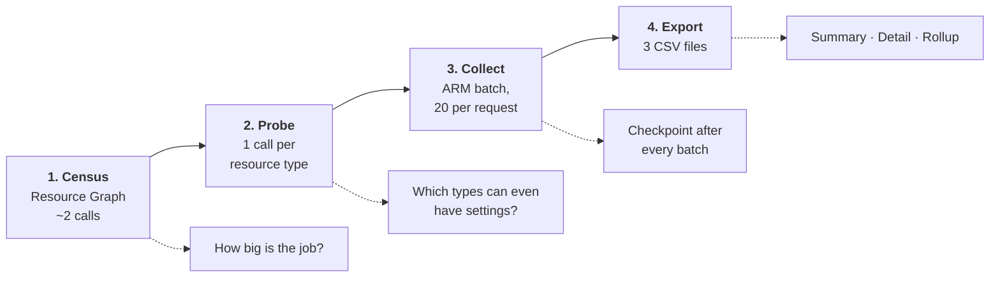
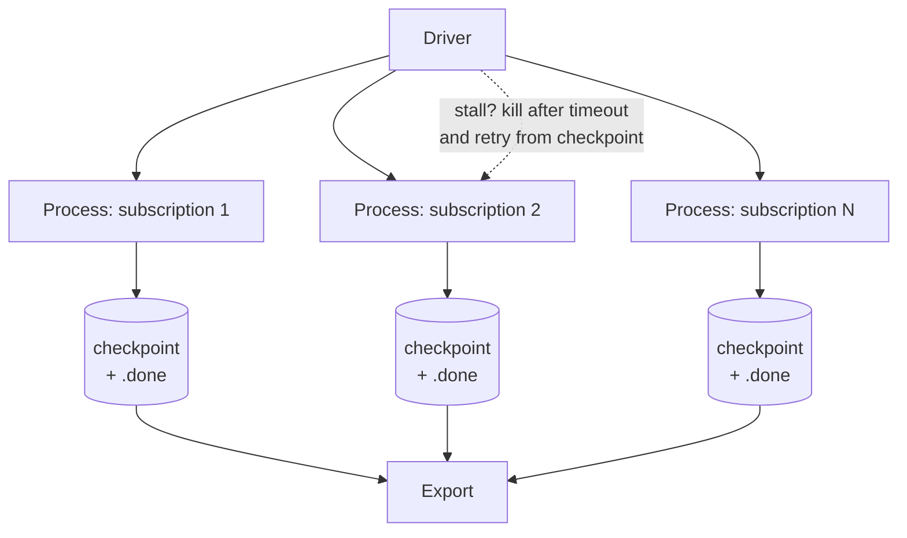

# Azure Diagnostic Settings Inventory

Tenant-wide inventory of **Azure Monitor diagnostic settings**, exported to CSV.

🌐 **English** · [Português (pt-BR)](README.pt-br.md)

Answers the question *"which resources in my Azure estate are sending logs and metrics
anywhere, and which are not?"* — across every subscription, in one pass, without changing
anything in the environment.

---

## Why this exists

The Azure portal shows diagnostic settings **one subscription at a time**, pages endlessly
on large subscriptions, and offers **no export**. It is a UI over a per-resource API, not
over an index.

The obvious workaround — a Resource Graph query — does not exist:

> **Azure Resource Graph does not index diagnostic settings.**
> They are ARM *extension* resources attached to the target resource. The `insightresources`
> table contains only `datacollectionruleassociations` and `tenantactiongroups`, and there is
> no `microsoft.insights/diagnosticsettings` entry in `resources`. No KQL query returns them.

That single constraint shapes the entire design. The only ways to learn the state are to ask
ARM per resource, or to let Azure Policy evaluate it for you. This solution does the former,
safely.



Both paths are analysed in [docs/en-us/design-notes.md](docs/en-us/design-notes.md). This
repository implements the read-only path because it requires **no configuration change** in
the target tenant.

---

## How it works

Four phases. Each one is cheap to repeat and safe to interrupt.



| Phase | What it does | Cost |
| --- | --- | --- |
| **Census** | Counts resources by type and by subscription | ~2 Resource Graph calls |
| **Probe** | Determines empirically which resource types support diagnostic settings, so there is no hardcoded list to rot | 1–2 calls per distinct type |
| **Collect** | Reads settings through the ARM batch endpoint, throttle-aware and resumable | 1 request per 20 resources |
| **Export** | Writes summary, detail and rollup CSVs | none |

**Collection is read-only.** The script never writes to the target tenant.

---

## Quick start

Azure Cloud Shell in **PowerShell** mode, with Reader on the scope you want to inventory.

```powershell
# 1. Size the job first — this turns every estimate into a number
./Get-DiagnosticSettingsInventory.ps1 -ManagementGroupId '<mg-root-id>' -Phase Census

# 2. Learn which resource types support diagnostic settings, then REVIEW the output
./Get-DiagnosticSettingsInventory.ps1 -ManagementGroupId '<mg-root-id>' -Phase Probe

# 3. Pilot on ONE subscription and watch the throttling counters
./Get-DiagnosticSettingsInventory.ps1 -SubscriptionId '<sub-id>' -TargetBatchesPerSecond 2

# 4. Full run — resumable, safe to re-run after an interruption
./Get-DiagnosticSettingsInventory.ps1 -ManagementGroupId '<mg-root-id>'
```

> **Pilot on a large subscription, not a convenient small one.** Large subscriptions behave
> qualitatively differently, not just proportionally slower. An estimate extrapolated from a
> 1,000-resource subscription will not survive contact with a 16,000-resource one.

**Full operating guide:** [docs/en-us/operations-guide.md](docs/en-us/operations-guide.md)

### Large estates

Tens of thousands of resources should not be collected in one long-lived process — it
degrades progressively and eventually stalls. Use the driver, which gives every subscription
its own short-lived process with a hard timeout:

```powershell
./Invoke-DiagnosticSettingsCollection.ps1 -BackupPath ~/dsi-progress.zip
```



---

## Outputs

| File | Contents |
| --- | --- |
| `diagnostic-settings-summary.csv` | Subscription, resource group, resource type, resource name, status — the reporting layout |
| `diagnostic-settings-detail.csv` | Destinations, workspace / storage / event hub IDs, setting names, log categories, metrics flag |
| `diagnostic-settings-rollup.csv` | Enabled and not-configured counts per subscription and type |

Detail costs nothing extra: the API returns the complete setting object in the same response
that answers the yes/no question. Drill-down is a matter of which file you open, not a second
scan.

### Status values — keep them distinct

| Value | Meaning |
| --- | --- |
| `Enabled` | One or more diagnostic settings exist |
| `NotConfigured` | The type supports diagnostic settings; none are configured |
| `AccessDenied` | HTTP 403 — insufficient rights. **Not** the same as "disabled" |
| `NotFound` | HTTP 404 — resource deleted between enumeration and read |
| `NotSupported` | The type cannot have diagnostic settings at all |
| `Error` | Other failure; see the detail CSV |

> **Never collapse these into "disabled".** `AccessDenied` means *you could not see it*, and
> `NotSupported` means *it could never exist*. Merging them into the gap number overstates the
> problem and destroys confidence in the whole report the moment someone spot-checks a row.

---

## Requirements

| Requirement | Notes |
| --- | --- |
| PowerShell **7+** | Cloud Shell PowerShell mode satisfies this |
| `Az.Accounts` | The only module needed — every call goes through `Invoke-AzRestMethod`, so there is no dependency on `Az.ResourceGraph` |
| **Reader** on the target scope | Anything unreadable is reported as `AccessDenied`, never silently dropped |
| No tenant changes | The solution is pure read |

---

## Repository layout

| Path | What it is |
| --- | --- |
| [scripts/Get-DiagnosticSettingsInventory.ps1](scripts/Get-DiagnosticSettingsInventory.ps1) | The collector — all four phases |
| [scripts/Invoke-DiagnosticSettingsCollection.ps1](scripts/Invoke-DiagnosticSettingsCollection.ps1) | Driver for large estates: one process per subscription |
| [docs/en-us/operations-guide.md](docs/en-us/operations-guide.md) | Step-by-step run guide, tuning, failure modes |
| [docs/en-us/design-notes.md](docs/en-us/design-notes.md) | Why this design, with sources; alternatives considered |
| [docs/pt-br/](docs/pt-br/) | Portuguese versions of both documents |

---

## Known limitations

- **Storage log categories** live on the `blobServices` / `fileServices` / `queueServices` /
  `tableServices` sub-resources, which Resource Graph does not index. The collector synthesizes
  their deterministic IDs, so each storage account costs 5 reads instead of 1. Disable with
  `-SkipStorageServices` at the cost of missing storage log settings.
- **The result is a rolling snapshot, not an instant.** A long run captures each subscription as
  of the moment it was processed. On an active estate the row count will not reconcile exactly
  against a fresh Resource Graph count — resources are created and deleted while the scan runs.
- **Subscriptions with zero supported resources produce no rows.** Absent must not be read as
  "nothing is logged"; it means "nothing here can be logged". Report those separately.
- **Subscription and management group** diagnostic settings (activity log export) are a separate
  API and are not collected. See the design notes.

---

## License and disclaimer

Released under the [MIT License](../../LICENSE).

Provided as-is, with no warranty. Review the script before running it in an environment you
care about, and always run the census and a single-subscription pilot first.
