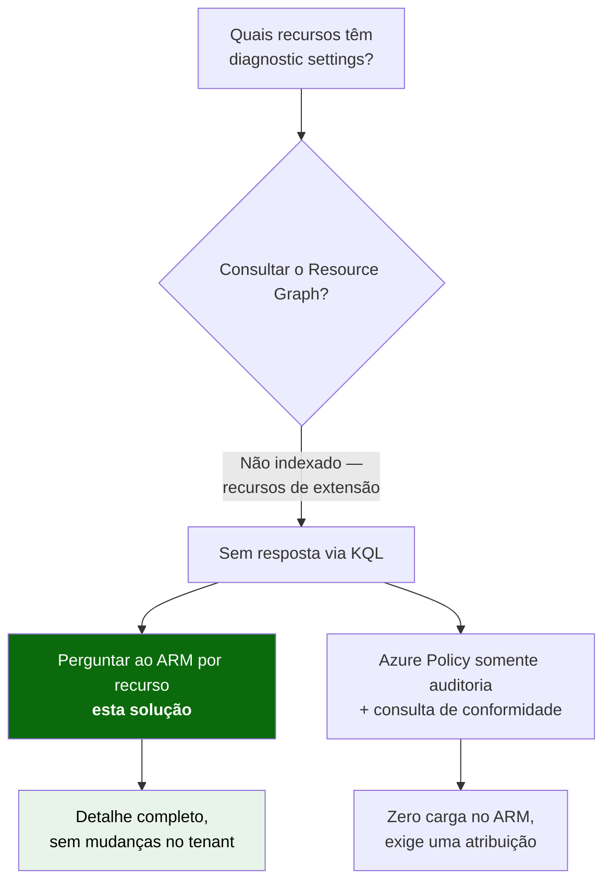
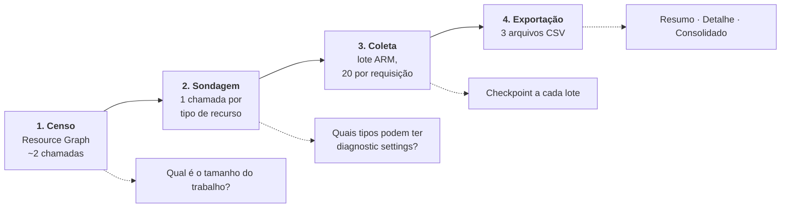
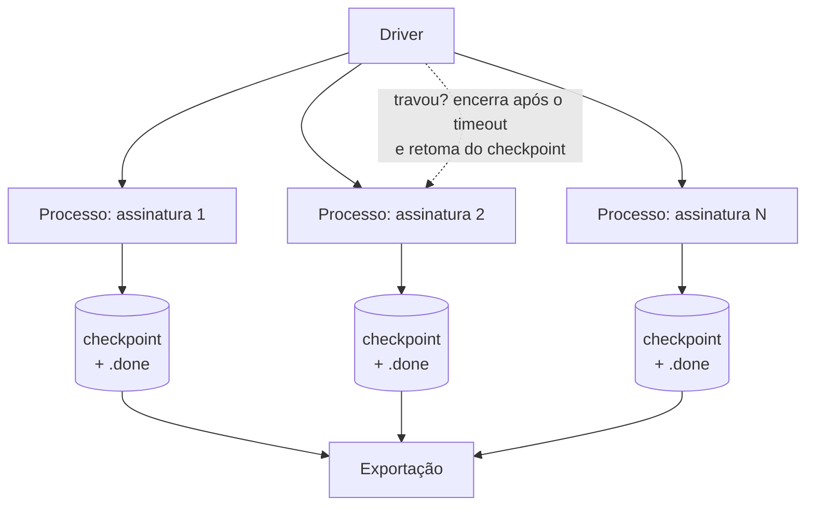

# Inventário de Diagnostic Settings do Azure

Inventário de **diagnostic settings do Azure Monitor** em todo o tenant, exportado para CSV.

🌐 [English](README.md) · **Português (pt-BR)**

Responde à pergunta *"quais recursos do meu ambiente Azure estão enviando logs e métricas para
algum destino, e quais não estão?"* — em todas as assinaturas, de uma só vez, sem alterar nada
no ambiente.

---

## Por que este projeto existe

O portal do Azure mostra diagnostic settings **uma assinatura por vez**, pagina indefinidamente
em assinaturas grandes e **não oferece exportação**. Ele é uma interface sobre uma API por
recurso, não sobre um índice.

A solução óbvia — uma consulta no Resource Graph — não existe:

> **O Azure Resource Graph não indexa diagnostic settings.**
> Elas são recursos de *extensão* do ARM, anexados ao recurso de destino. A tabela
> `insightresources` contém apenas `datacollectionruleassociations` e `tenantactiongroups`, e não
> existe `microsoft.insights/diagnosticsettings` na tabela `resources`. Nenhuma consulta KQL as
> retorna.

Essa única restrição define todo o desenho da solução. As únicas formas de descobrir o estado são
perguntar ao ARM recurso a recurso, ou deixar o Azure Policy avaliar por você. Esta solução faz o
primeiro, de forma segura.



As duas alternativas estão analisadas em
[docs/pt-br/notas-de-design.md](docs/pt-br/notas-de-design.md). Este repositório implementa o
caminho somente leitura porque ele **não exige nenhuma mudança de configuração** no tenant
avaliado.

---

## Como funciona

Quatro fases. Cada uma é barata de repetir e segura de interromper.



| Fase | O que faz | Custo |
| --- | --- | --- |
| **Censo** | Conta recursos por tipo e por assinatura | ~2 chamadas ao Resource Graph |
| **Sondagem** | Determina empiricamente quais tipos suportam diagnostic settings, sem lista fixa que envelhece | 1–2 chamadas por tipo distinto |
| **Coleta** | Lê as configurações via endpoint de lote do ARM, com controle de throttling e retomada | 1 requisição a cada 20 recursos |
| **Exportação** | Gera os CSVs de resumo, detalhe e consolidado | nenhum |

**A coleta é somente leitura.** O script nunca escreve no tenant avaliado.

---

## Início rápido

Azure Cloud Shell em modo **PowerShell**, com permissão Reader no escopo a inventariar.

```powershell
# 1. Dimensione o trabalho primeiro — isso transforma estimativa em número
./Get-DiagnosticSettingsInventory.ps1 -ManagementGroupId '<mg-root-id>' -Phase Census

# 2. Descubra quais tipos suportam diagnostic settings e REVISE a saída
./Get-DiagnosticSettingsInventory.ps1 -ManagementGroupId '<mg-root-id>' -Phase Probe

# 3. Faça um piloto em UMA assinatura e observe os contadores de throttling
./Get-DiagnosticSettingsInventory.ps1 -SubscriptionId '<sub-id>' -TargetBatchesPerSecond 2

# 4. Execução completa — retomável, seguro reexecutar após interrupção
./Get-DiagnosticSettingsInventory.ps1 -ManagementGroupId '<mg-root-id>'
```

> **Faça o piloto em uma assinatura grande, não na mais conveniente.** Assinaturas grandes se
> comportam de forma qualitativamente diferente, não apenas proporcionalmente mais lenta. Uma
> estimativa extrapolada de uma assinatura de 1.000 recursos não sobrevive ao contato com uma de
> 16.000.

**Guia completo de operação:** [docs/pt-br/guia-de-operacao.md](docs/pt-br/guia-de-operacao.md)

### Ambientes grandes

Dezenas de milhares de recursos não devem ser coletados em um único processo de longa duração —
ele degrada progressivamente e acaba travando. Use o driver, que dá a cada assinatura seu próprio
processo de vida curta com timeout rígido:

```powershell
./Invoke-DiagnosticSettingsCollection.ps1 -BackupPath ~/dsi-progress.zip
```



---

## Saídas

| Arquivo | Conteúdo |
| --- | --- |
| `diagnostic-settings-summary.csv` | Assinatura, resource group, tipo, nome do recurso e status — o layout de relatório |
| `diagnostic-settings-detail.csv` | Destinos, IDs de workspace / storage / event hub, nomes das settings, categorias de log, flag de métricas |
| `diagnostic-settings-rollup.csv` | Contagem de habilitados e não configurados por assinatura e tipo |

O detalhe não custa nada a mais: a API devolve o objeto completo da configuração na mesma
resposta que responde à pergunta sim/não. Aprofundar é escolher qual arquivo abrir, não fazer uma
segunda varredura.

### Valores de status — mantenha-os distintos

| Valor | Significado |
| --- | --- |
| `Enabled` | Existe uma ou mais diagnostic settings |
| `NotConfigured` | O tipo suporta diagnostic settings; nenhuma está configurada |
| `AccessDenied` | HTTP 403 — permissão insuficiente. **Não** é o mesmo que "desabilitado" |
| `NotFound` | HTTP 404 — recurso excluído entre a enumeração e a leitura |
| `NotSupported` | O tipo não pode ter diagnostic settings |
| `Error` | Outra falha; consulte o CSV de detalhe |

> **Nunca colapse esses valores em "desabilitado".** `AccessDenied` significa *você não conseguiu
> enxergar*, e `NotSupported` significa *nunca poderia existir*. Juntá-los ao número da lacuna
> superestima o problema e destrói a confiança em todo o relatório assim que alguém conferir uma
> linha por amostragem.

---

## Requisitos

| Requisito | Observações |
| --- | --- |
| PowerShell **7+** | O Cloud Shell em modo PowerShell atende |
| `Az.Accounts` | Único módulo necessário — todas as chamadas passam por `Invoke-AzRestMethod`, sem dependência de `Az.ResourceGraph` |
| **Reader** no escopo avaliado | O que não for legível é reportado como `AccessDenied`, nunca descartado silenciosamente |
| Nenhuma mudança no tenant | A solução é puramente de leitura |

---

## Estrutura do repositório

| Caminho | O que é |
| --- | --- |
| [scripts/Get-DiagnosticSettingsInventory.ps1](scripts/Get-DiagnosticSettingsInventory.ps1) | O coletor — as quatro fases |
| [scripts/Invoke-DiagnosticSettingsCollection.ps1](scripts/Invoke-DiagnosticSettingsCollection.ps1) | Driver para ambientes grandes: um processo por assinatura |
| [docs/pt-br/guia-de-operacao.md](docs/pt-br/guia-de-operacao.md) | Guia passo a passo, ajustes e modos de falha |
| [docs/pt-br/notas-de-design.md](docs/pt-br/notas-de-design.md) | Por que este desenho, com fontes; alternativas consideradas |
| [docs/en-us/](docs/en-us/) | Versões em inglês dos dois documentos |

---

## Limitações conhecidas

- **As categorias de log de storage** ficam nos sub-recursos `blobServices` / `fileServices` /
  `queueServices` / `tableServices`, que o Resource Graph não indexa. O coletor sintetiza os IDs
  determinísticos, então cada storage account custa 5 leituras em vez de 1. Desative com
  `-SkipStorageServices`, ao custo de perder as settings de log de storage.
- **O resultado é um retrato progressivo, não instantâneo.** Uma execução longa captura cada
  assinatura no momento em que ela foi processada. Em um ambiente ativo, a contagem de linhas não
  vai reconciliar exatamente com uma contagem nova do Resource Graph.
- **Assinaturas sem recursos suportados não geram linhas.** Ausente não significa "nada é
  logado"; significa "nada aqui pode ser logado". Reporte essas assinaturas separadamente.
- **Diagnostic settings de assinatura e de management group** (exportação do activity log) usam
  outra API e não são coletadas. Veja as notas de design.

---

## Licença e aviso

Distribuído sob a [Licença MIT](../../LICENSE).

Fornecido no estado em que se encontra, sem garantias. Revise o script antes de executá-lo em um
ambiente crítico e sempre faça o censo e um piloto de uma assinatura primeiro.
